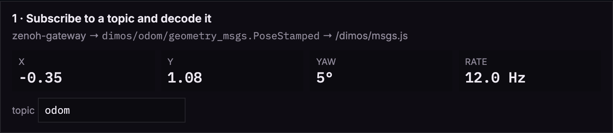
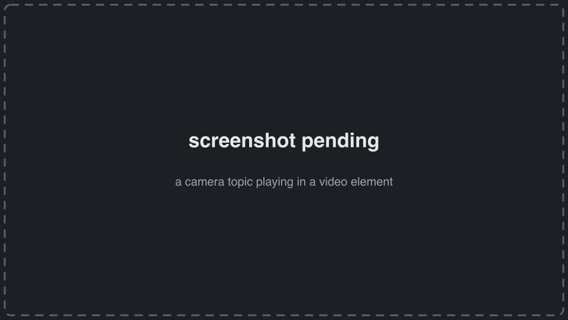
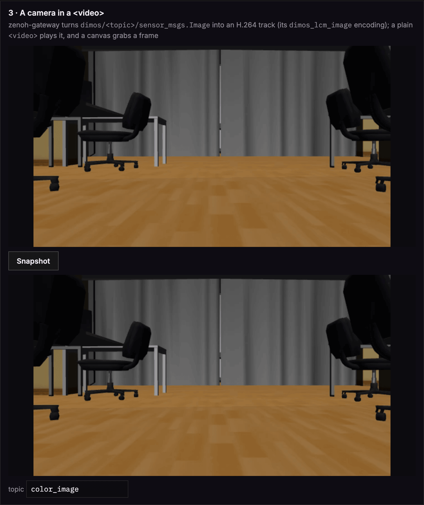
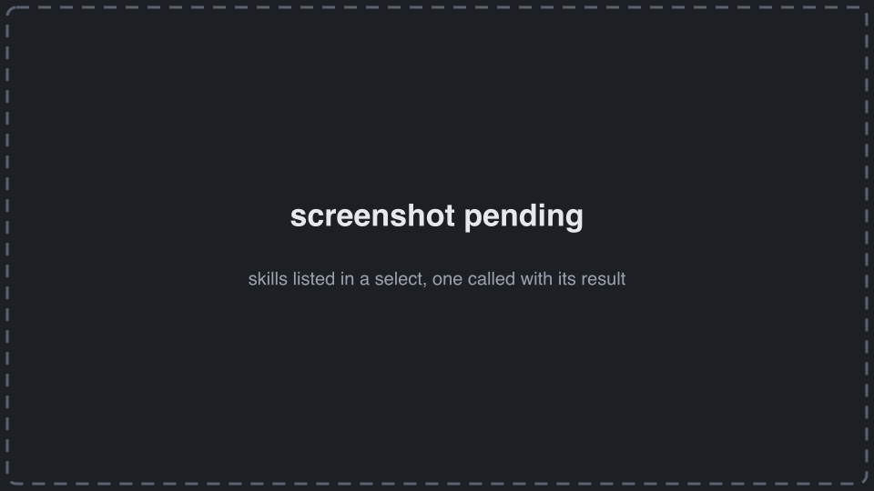
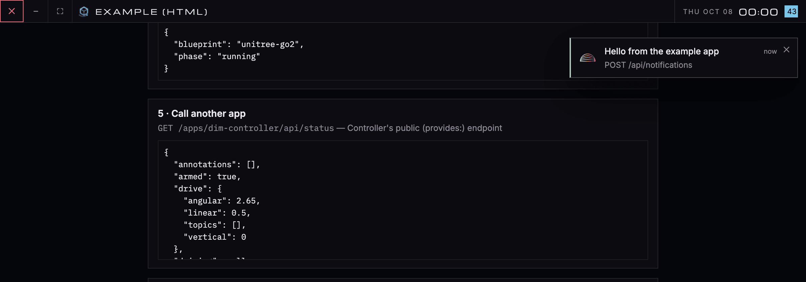
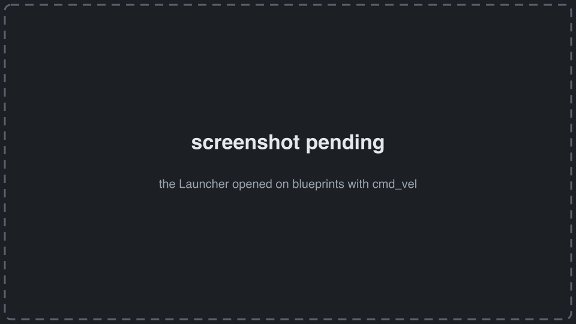
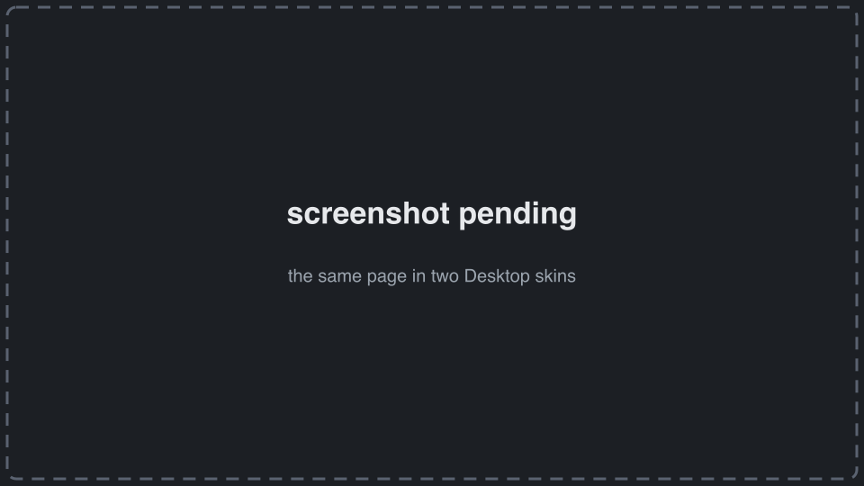

# dim-example-html

```sh
dimos-desktop install github.com/jeff-hykin/dim-example-html
```

(or Desktop → App Store → **Install From URL** → `github.com/jeff-hykin/dim-example-html`)

[](https://github.com/jeff-hykin/dim-example-html/generate)

A [dimOS Desktop](https://github.com/jeff-hykin/dimos-desktop-mirror) app in one file, `frontend/index.html`: no build,
no server. Every snippet below is from that file, trimmed to the point. How apps work:
**[Making a dimOS app](https://github.com/jeff-hykin/dimos-desktop-mirror/blob/main/docs/create-apps/index.md)**.
Other examples: [Deno + React](https://github.com/jeff-hykin/dim-example-deno) ·
[Rust](https://github.com/jeff-hykin/dim-example-rust).

## Connect

One import, by URL. `DimApp` holds the page's zenoh-gateway connection and loads dimos's message codec
(`/dimos/msgs.js`, generated from the dimos that's running).

```js
import { DimApp } from "https://esm.sh/gh/jeff-hykin/dim-app@v0.20.1/source/dim_app.js"

const app = new DimApp({
    msgDecodeEndpoint: "../../dimos/msgs.js",
    // a heartbeat lets the gateway publish our deadman (a zero Twist) if this page dies mid-drive
    connectOptions: { heartbeatHz: 5, heartbeatMisses: 3 },
})
```

## Subscribe to a topic, decoded

`/odom` arrives as a plain `geometry_msgs.PoseStamped` object.

```js
const options = { type: "geometry_msgs.PoseStamped", delivery: "latest", maxHz: 20 }
unsubscribeOdom = app.subscribe($("odomTopic").value, ({ pose }) => {
    const { x, y, z, w } = pose.orientation
    const yaw = Math.atan2(2 * (w * z + x * y), 1 - 2 * (y * y + z * z))
    $("x").textContent = pose.position.x.toFixed(2)
    $("y").textContent = pose.position.y.toFixed(2)
    $("yaw").textContent = `${(yaw * 180 / Math.PI).toFixed(0)}°`
}, options)
```



## A camera in a `<video>`

The gateway turns a `sensor_msgs.Image` topic into an H.264 track; a plain `<video>` plays it.

```html
<video id="camera" autoplay muted playsinline></video>
```

```js
const key = `dimos/${$("cameraTopic").value}/sensor_msgs.Image`
const options = { delivery: "latest", maxHz: 30, encoding: "dimos_lcm_image" }
unsubscribeCamera = app.zenoh.subscribe(key, options, ({ mediaStream }) => {
    if (mediaStream && $("camera").srcObject !== mediaStream) {
        $("camera").srcObject = mediaStream
    }
})
```



## Snapshot the video

Draw the playing frame on a canvas; keep it as a PNG.

```js
$("snapshot").addEventListener("click", () => {
    const video = $("camera")
    const canvas = Object.assign(document.createElement("canvas"), { width: video.videoWidth, height: video.videoHeight })
    canvas.getContext("2d").drawImage(video, 0, 0)
    $("still").src = canvas.toDataURL("image/png")
    $("still").hidden = false
})
```



## Drive: publish `cmd_vel` with a deadman

Nothing goes out until a button is pressed. While driving, a zero Twist is armed on the gateway as the deadman (sent if
the page dies); the release sends it and disarms.

```js
// trimmed: the page wires three buttons this way
const twist = (forward, turn) => ({ linear: { x: forward }, angular: { z: turn } }) // fields left out are zero

publisher = await app.publisher($("cmdTopic").value, "geometry_msgs.Twist", { delivery: "latest" })
await publisher.setDeadman(twist(0, 0))

button.addEventListener("pointerdown", () => {
    driving = setInterval(() => publisher.put(twist(0.3, 0)), 100) // 10 Hz while held
})
button.addEventListener("pointerup", () => {
    clearInterval(driving)
    publisher.stop() // the zero Twist, then silence
})
```


## Ask dimos what's running

```js
const { launch } = await json("../../dimos/runs")
// { blueprint: "unitree-go2-basic", phase: "running" }, or null
```

## Call another app

Another app's public endpoint (its `provides:`), at `../../apps/<name>/`.

```js
await json("../../apps/dim-controller/api/status")
```

## Call a skill

List the running blueprint's skills into a `<select>`; call one only on a click (a skill can move the robot).

```js
const { skills } = await json("../../dimos/skills") // [{ name, module, description, params (JSON Schema) }]
$("skill").replaceChildren(...skills.map(({ name, module }) => new Option(`${module}.${name}`, name)))

$("callSkill").addEventListener("click", () => {
    const { name, module } = skills[$("skill").selectedIndex]
    json("../../dimos/skills/call", {
        method: "POST",
        headers: { "content-type": "application/json" },
        body: JSON.stringify({ skill: name, module, args: JSON.parse($("skillArgs").value || "{}") }),
    }) // { ok, text, via, ... }
})
```



## A Desktop notification

```js
json("../../api/notifications", {
    method: "POST",
    headers: { "content-type": "application/json" },
    body: JSON.stringify({ title: "Hello from the example app", body: "POST /api/notifications", kind: "ok" }),
})
```



## Open the Launcher, filtered

```js
import { openApp } from "https://esm.sh/gh/jeff-hykin/dim-app@v0.20.1/source/desktop.js"

openApp("launcher", { stream: "cmd_vel" }) // only blueprints that drive a robot; also query, robot, selected
```



## Look like Desktop in every skin

Link Desktop's theme tokens and style only with them:

```html
<link rel="stylesheet" href="../../theme.css" />
<style>
    body { background: var(--bg); color: var(--fg); font: 14px/1.5 var(--sans); }
    section { background: var(--surface); border: 1px solid var(--border); border-radius: var(--radius-lg); }
</style>
```

and follow the skin the person picked:

```js
function applyTheme() {
    try {
        document.documentElement.dataset.skin = localStorage.getItem("portal.theme") || "portal"
        const corners = localStorage.getItem("portal.corners")
        if (corners && corners !== "theme") {
            document.documentElement.dataset.corners = corners
        }
    } catch {
        // storage unavailable (outside Desktop): the theme.css default (Portal) stays
    }
}
applyTheme()
addEventListener("storage", applyTheme)
```



## Declare what it calls: `dimos.yaml`

Desktop refuses (403 + a notification) any call not listed here.

```yaml
title: Example (HTML)
spec-version: v1.0
uses:
    "@dimos-gateway":
        - GET /runs
        - GET /msgs.js
        - GET /skills
        - POST /skills/call
    "@desktop-gateway":
        - POST /api/notifications
    "@zenoh-gateway": ">=0.5 <0.6"
    dim-controller:
        - GET api/status
```

Check it: `dimos-desktop app check .`

## Files

- `frontend/index.html`: the whole app. With no `flake.nix`, Desktop serves only `frontend/`, as is, at `/apps/<name>/`
- `dimos.yaml`: the contract with Desktop
- `icon.svg`: its icon in the dock and App Store
